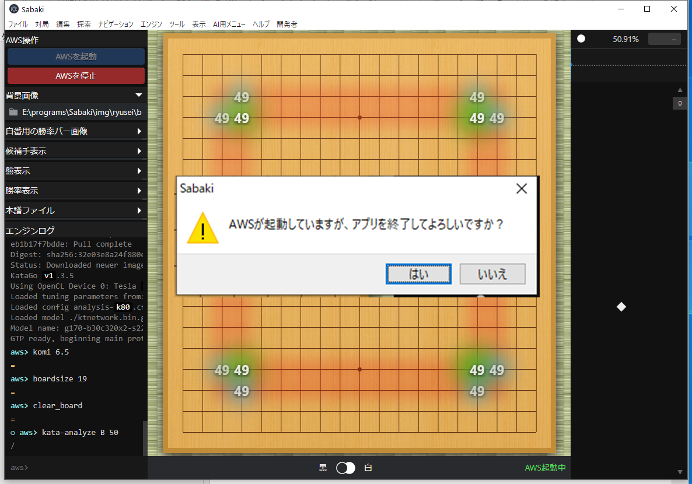
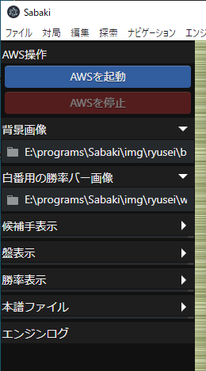
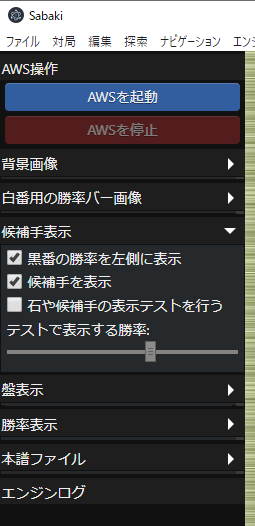
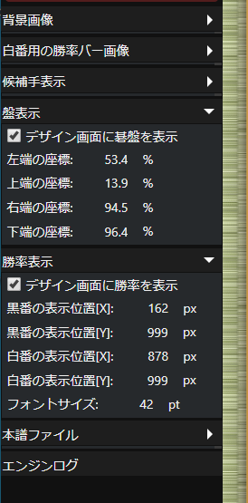
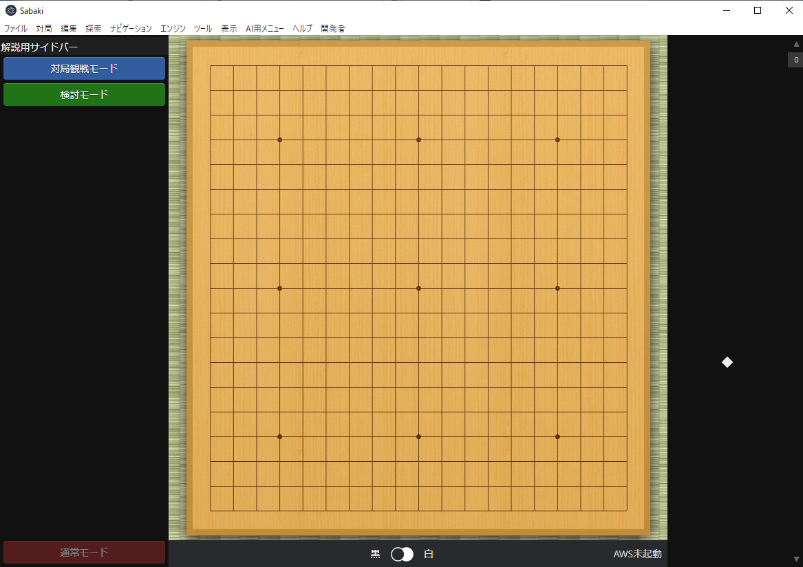

# 囲碁 AI 勝率表示ソフト

For full documentation visit [mkdocs.org](https://mkdocs.org).

# 概要

- **対局室**： 室内にいる記録係／読上げ係による本譜の入力を行います。ソフトに手を入力すると棋譜の変更が解説や管理室に伝わります。
- **解説室**： 本譜とAIによる勝率などを参考にしながら解説を行います。解説では本譜の手を自動更新しながらも、自由に石を置き検討を行います。

# 操作画面

検討や棋譜入力は基本的にこの画面上で行います。検討モードや対局観戦モードでは囲碁AIにより解析された候補手とその勝率が解説者に表示されます。

# デザイン画面

デザイン画面はユーザーに見せるための画面です。背景画像と白番バー画像を変更することで様々なデザインを実現できるようになっています。囲碁AIによる候補手と各候補手の勝率も表示されます。

## デザイン画面表示の仕組み

デザイン画面では上図のように背景画像の上に白番用の勝率バー画像を重ねて表示することで、黒番・白番バーを動かせるようにしています。黒勝勢のときは上に重なっている白番バーの画像の表示領域を小さくすることで、背景画像に描かれた黒番バーの表示を大きくしています。逆に白優勢のときは白番バー画像の表示範囲を広くし、背景画像に描かれた黒番バーを塗りつぶすようにしています。

## 背景画像作成時の注意点

- 背景画像には黒番バーを表示した状態で画像を出力してください。また、白番バーの表示は一切しないようにしてください。
- 白番バー画像では白番バーの部分のみを描き、その他の部分は透明化するようにしてください。また、Photoshopなどでレイヤ分けされている場合は、白番バーをレイヤの一番上に持っていき、他のレイヤで隠された部分がないかを確認してから画像を出力してください。

## デザイン画面・検討中

検討モードでは勝率の表示が消えますが、囲碁AIは本譜の手をずっと解析しています。また、検討時に打った石にはマークがつき本譜ではないということがすぐにわかるようになっています。

# メインメニュー: AI用メニュー

- **管理者用サイドバーを表示**：　管理者用サイドバーを表示します。
- **解説用サイドバーを表示**：　解説者時に使うサイドバーを表示します。
- **本譜入力用サイドバーを表示**：　本譜入力時に使うサイドバーを表示します。
- **デザインウィンドウを表示**：　デザイン画面を表示するウィンドウを新しく表示します。
- **デザイン設定を読み込み**：　管理者用サイドバーで設定したデザイン周りの設定をファイルから読み込みます。
- **デザイン設定を保存**：　デザイン周りの設定をファイルに保存します。

# 管理者用サイドバー

## AWSを起動・AWSを停止

- **AWSを起動**：　囲碁AIを動かすためのクラウドコンピューターをAWS上に起動します。AWSの状態は右下のテキストに表示されます。
- **AWSを停止**：　AWSのクラウドコンピューターを停止します。

|  AWSの各状態     |          状態の説明                             |
| ---------------- | --------------------------------------------- |  
| **AWS未起動**       | AWSのクラウドコンピューターが起動されていません。 |  
| **AWS起動準備中**   | AWSのクラウドコンピューターが起動準備中です。 しばらくたつとコンピューターが起動されます。 |  
| **AWS起動中**       | AWSのクラウドコンピューターが起動中です。 |  
| **AWS停止中**       | AWSのクラウドコンピューターを停止中です。 しばらくたつとコンピューターが未起動状態になります。 |  
| **AWSでエラー発生** | AWSで何らかのエラーが発生しました。 AWSを停止するか、ソフトの再起動などを試してみてください。 |

## アプリ終了時の確認

AWS起動中・AWS起動準備中にアプリを終了しようとすると上記のようなダイアログが出ます。もし必要であればAWSを停止してからアプリを終了してください。

## 画像設定

- **背景画像**：　デザイン画面に表示される背景画像を設定します。
- **白番用の勝率バー画像**：　デザイン画面で表示される勝率バーの白番用画像を設定します。

## 候補手表示

- **黒番の勝率を左側に表示**：　黒番の勝率を左側に表示します。チェックが入っていない場合は黒番の勝率が右側に表示され、それに合わせて勝率バーの表示も入れ替わります。
- **候補手を表示**：　デザイン画面上に候補手を表示します。
- **石や候補手の表示テストを行う**：　デザイン画面上にテスト用の盤面と候補手を表示します。
- **テストで表示する勝率**：　表示テストを行っているときに表示する勝率を設定します。

## 盤表示・勝率表示

- **デザイン画面に碁盤を表示**：　デザイン画面に碁盤を表示するか設定します。
- **左端の座標、上端の座標、右端の座標、下端の座標**：　デザイン画面上に表示する碁盤の座標を設定します。設定は左上を0%, 右下を100%とした座標値のパーセントで行います。
- **デザイン画面に勝率を表示**：　デザイン画面に勝率の数値を表示するか設定します。
- **黒番の表示位置[X], 黒番の表示位置[Y]**：　黒番の勝率の数値を表示するX,Y座標を設定します。座標は背景画像のサイズにおけるピクセル値で指定します。
- **白番の表示位置[X], 白番の表示位置[Y]**：　白番の勝率の数値を表示するX,Y座標を設定します。座標は背景画像のサイズにおけるピクセル値で指定します。

## 棋譜ファイル

- **棋譜ファイル**：　本譜を保存・読み込む先の棋譜ファイルを設定します。棋譜入力モードではこのファイルに棋譜を保存します。対局観戦モード・検討モードでは棋譜の読み込み先となるファイルとなります。

# 解説用サイドバー

- **対局観戦モード**：　対局観戦モードに移行します。このモードでは入力された本譜の手を監視し、もし変更があれば盤面を最新局面に自動的に移動します。AIによる検討盤面も最新局面に自動的に移動します。また、ユーザーが手を進めたり戻したりすることは一切できません。閲覧のみのモードになります。

- **検討モード**：　検討モードに移行します。このモードでは検討したい手を自由に打つことができます。AIによる検討盤面は読み込んでいる棋譜の最新盤面で固定され、もし盤面を移動した場合でも勝率や候補手などは変化しません。また、検討中に打った手にはマークがつき、本譜ではない手ということがすぐ分かるようになっています。

- **通常モード**：　本譜の読み込みなどをやめます。また、囲碁AIは表示盤面を検討するようになります。

# 本譜入力用サイドバー

- **棋譜入力モード**：　本譜入力用のモードになります。手を入力した場合や手を戻した場合は、棋譜が自動的に管理用サイドバーで設定した棋譜ファイルに自動的に保存されます。
- **最終着手**：　最後に着手した手の座標を表示します。
